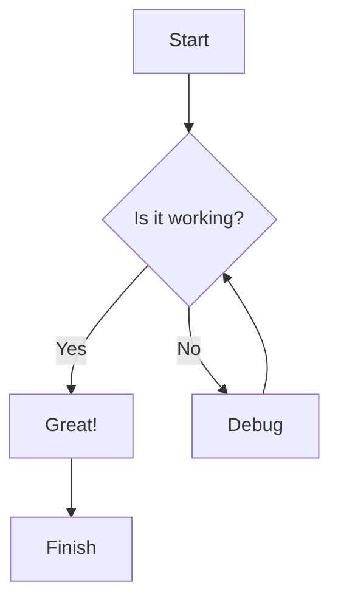
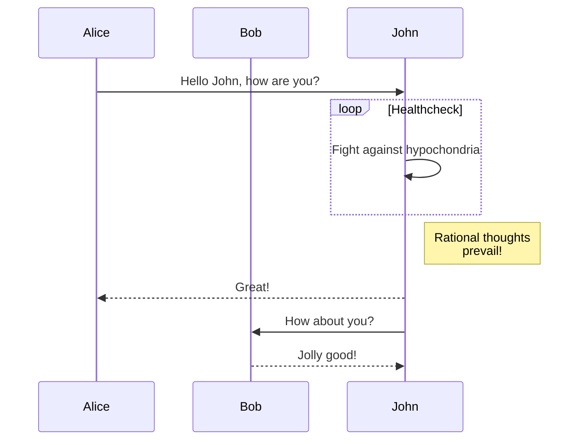
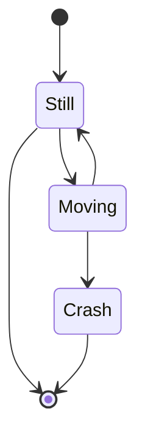
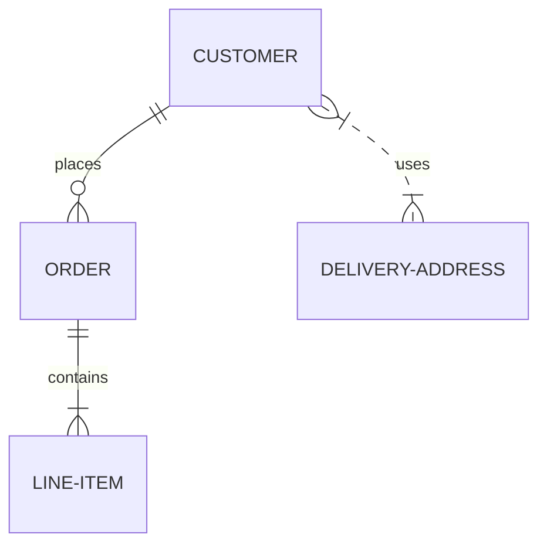
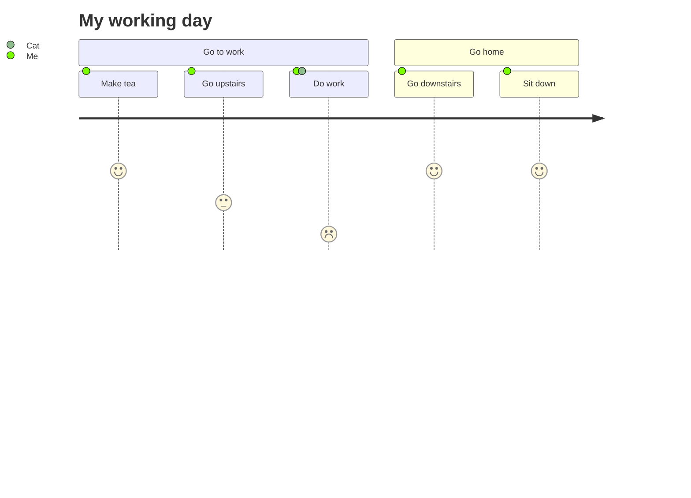
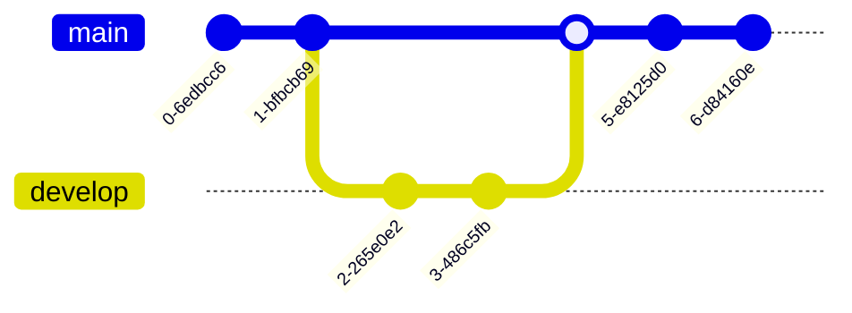
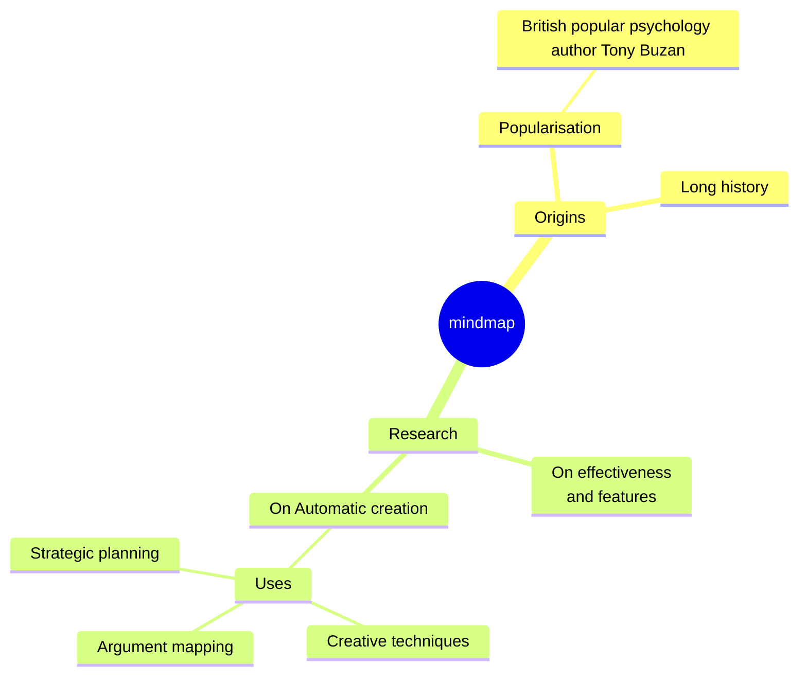
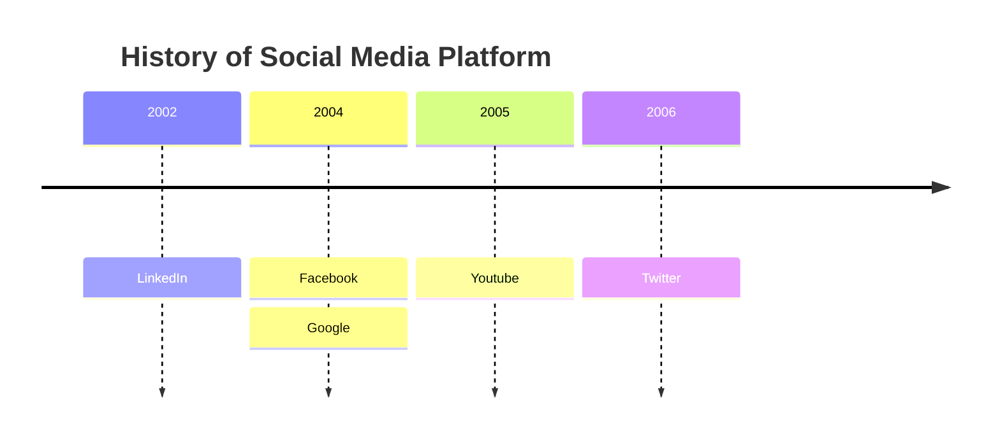

# Mermaid Diagrams

Mermaid is a syntax for creating diagrams and flowcharts from text in markdown.

## Flowchart

## Sequence Diagram

## State Diagram

## Entity Relationship Diagram

## User Journey

## Git Graph

## Mindmap

## Timeline

